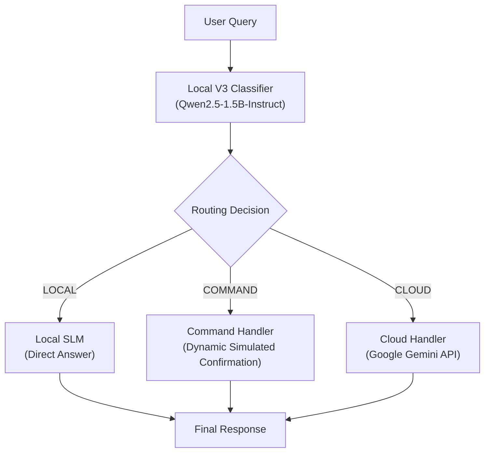

# SLM Router

[](https://youtu.be/Isrp2F3n6u0)

> Local AI Request Classification & Intelligent 3-Way Dispatch.

SLM Router classifies incoming natural language requests on-device using a Small Language Model (SLM) and automatically routes each query to the optimal execution path: answering locally on-device, generating a safe simulated command confirmation, or offloading complex workloads to Google Gemini.

---

## Quick Start

```bash
# 1. Clone the repository
git clone <repository-url>
cd SLM-Router

# 2. Sync/install dependencies with uv
uv sync

# 3. Download and cache the Qwen2.5-1.5B-Instruct model locally (one-time setup)
uv run python -c "from slm_router.model import SLM; SLM()"

# 4. Create the .env file from .env.example
cp .env.example .env

# 5. Add your Gemini API key in .env
# Edit .env and set: GEMINI_API_KEY=your_actual_key

# 6. Launch the FastAPI server
uv run uvicorn slm_router.api:app --host 127.0.0.1 --port 8000
```

### API Usage

Start the server:
```bash
uv run uvicorn slm_router.api:app --host 127.0.0.1 --port 8000
```

#### 1. Health Check (`GET /health`)
```bash
curl -s http://127.0.0.1:8000/health
```
Response:
```json
{
  "status": "healthy",
  "model": "Qwen/Qwen2.5-1.5B-Instruct"
}
```

#### 2. Classify Query (`POST /classify`)
```bash
curl -s -X POST http://127.0.0.1:8000/classify \
  -H "Content-Type: application/json" \
  -d '{"query": "What is 2 + 2?"}'
```
Response:
```json
{
  "query": "What is 2 + 2?",
  "label": "LOCAL",
  "raw_output": "LOCAL"
}
```

#### 3. Route Query (`POST /route`)
```bash
curl -s -X POST http://127.0.0.1:8000/route \
  -H "Content-Type: application/json" \
  -d '{"query": "What is 2 + 2?"}'
```
Response:
```json
{
  "query": "What is 2 + 2?",
  "route": "LOCAL",
  "handler": "Local SLM",
  "response": "The sum of 2 plus 2 is 4.",
  "success": true,
  "model": "Qwen/Qwen2.5-1.5B-Instruct",
  "timings": {
    "classification": 1.12,
    "handler": 0.68,
    "total": 1.80
  }
}
```


---

## Project Overview

Modern AI architectures often route every user request directly to expensive cloud Large Language Models (LLMs). This introduces several trade-offs:
- **Cost**: Simple queries consume cloud API tokens unnecessarily.
- **Latency**: Round-trip network requests add latency for trivial lookups.
- **Privacy**: User queries and internal automation intents leave the local machine.
- **Offline Resilience**: Complete dependency on cloud uptime and internet connectivity.

Conversely, relying solely on an on-device SLM degrades quality when handling open-ended research, long-form generation, or multi-step reasoning.

**SLM Router** bridges this gap:
1. An on-device SLM (`Qwen/Qwen2.5-1.5B-Instruct`) inspects and classifies the query locally with millisecond latency.
2. Lightweight requests are answered directly on-device.
3. Command and automation intents are safely confirmed on-device without invoking external APIs.
4. Heavy, complex workloads are offloaded to Google Gemini via the official `google-genai` SDK.

---

## Architecture

A single loaded instance of `Qwen/Qwen2.5-1.5B-Instruct` is shared in memory across classification, local generation, and command confirmation to maintain a minimal RAM footprint.



---

## Routing Categories

| Route | Execution Engine | Description | Example |
|---|---|---|---|
| **LOCAL** | Local SLM (`Qwen2.5-1.5B-Instruct`) | Factual questions, explanations, basic math, code snippets, and direct Q&A answered on-device. | *"What causes tides in the ocean?"* |
| **COMMAND** | Local SLM (`Qwen2.5-1.5B-Instruct`) | Device control, task automation, or system action intents. The local SLM dynamically generates a natural confirmation of the requested action. All execution is simulated; no operating system commands are executed. | *"Turn the garden sprinkler on for 15 minutes."* |
| **CLOUD** | Google Gemini (`gemini-3.6-flash`) | Deep research, open-ended generation, long-form creative writing, complex business planning, and heavy analytical tasks offloaded to the cloud. | *"Plan a three-day itinerary for exploring Kyoto during cherry blossom season."* |

---

## Technology Stack

- **Runtime & Environment**: Python `>= 3.11`, managed with [`uv`](https://docs.astral.sh/uv/)
- **Machine Learning**: PyTorch (`torch`), Hugging Face Transformers (`transformers`)
- **Local Model**: `Qwen/Qwen2.5-1.5B-Instruct` (~3.1 GB model weights)
- **Cloud Provider**: Google Gemini API via the official `google-genai` Python SDK
- **Web Application**: Streamlit
- **Configuration**: `python-dotenv`

---

## Project Structure

```
SLM-Router/
├── app.py                             # Streamlit web application interface
├── pyproject.toml                     # Package metadata, dependencies, and build config
├── uv.lock                            # Deterministic dependency lockfile
├── .env.example                       # Environment configuration template
├── .gitignore                         # Git ignore rules (protects .env and caches)
├── README.md                          # Project documentation
└── src/
    └── slm_router/
        ├── __init__.py                # Package version definition
        ├── model.py                   # Centralized SLM loader with runtime device selection
        ├── classifier_v3.py           # Frozen V3 on-device query classifier
        ├── router.py                  # 3-way request router with execution telemetry
        ├── cloud.py                   # Gemini integration, mock fallback, and error sanitation
        ├── commands.py                # Simulated command demonstration state
        └── tests/                     # Test suite and evaluation benchmarks
            ├── test_router.py         # Router unit and integration tests
            ├── test_phase3.py         # Cloud handler and timing tests
            ├── test_classifier_v2.py  # Classifier comparison tests
            ├── capability_benchmark.py# Model capability evaluation runner
            ├── label_dataset.py       # Dataset labeling utility
            └── data/                  # Evaluation datasets
                ├── capability_dataset.jsonl
                └── capability_labeled.jsonl
```

---

## Requirements

- **Operating System**: macOS, Linux, or Windows
- **Python**: `>= 3.11`
- **Package Manager**: `uv` (recommended)
- **Memory**: Minimum 4 GB RAM available for CPU inference (8 GB+ recommended)
- **Disk Space**: ~3.5 GB for cached Hugging Face model weights
- **Network**: Internet connection for the initial model download and for live Google Gemini cloud routing

---

## Installation

### 1. Install `uv`
On Linux or macOS:
```bash
curl -LsSf https://astral.sh/uv/install.sh | sh
```
On Windows (PowerShell):
```powershell
powershell -ExecutionPolicy ByPass -c "irm https://astral.sh/uv/install.ps1 | iex"
```

### 2. Clone and Synchronize Dependencies
```bash
git clone <repository-url>
cd SLM-Router
uv sync
```
`uv sync` will create a virtual environment (`.venv`), install all required dependencies (PyTorch, Transformers, Streamlit, `google-genai`), and install the `slm-router` package in editable mode.

### 3. Download and Cache the Local Model
`uv sync` installs the Python dependencies but does not download the Hugging Face model weights. Run this one-time command to initialize the model using the project's device detection and cache it locally:

```bash
uv run python -c "from slm_router.model import SLM; SLM()"
```

- **First Run**: Automatically downloads `Qwen/Qwen2.5-1.5B-Instruct` (~3.1 GB) from Hugging Face.
- **Local Caching**: The model is saved to your local Hugging Face cache directory and reused on all subsequent runs.
- **Network Requirement**: Internet access is required during this initial download step.
- **No Token Required**: No Hugging Face API token is needed for this public model (though unauthenticated downloads are subject to standard public rate limits).

### 4. Configure Environment Variables
Create your `.env` configuration file from the template:

```bash
cp .env.example .env
```

### 5. Add Your Gemini API Key
Edit `.env` and insert your Google Gemini API key:

```env
GEMINI_API_KEY=your_actual_key
CLOUD_MODEL=gemini-3.6-flash
CLOUD_MODE=live
```

#### Settings Reference:
- `GEMINI_API_KEY`: Your Google AI Studio API key.
  - If left blank, the router automatically falls back to safe **Mock Mode** without throwing errors.
- `CLOUD_MODEL`: The target Gemini model (defaults to `gemini-3.6-flash`).
- `CLOUD_MODE`:
  - `live`: Dispatches cloud requests to Google Gemini via the official SDK.
  - `mock`: Simulates cloud offloading locally without making external network calls.

> **Security Note**: Never commit your `.env` file. It is explicitly ignored by `.gitignore`.

### 6. Launch the Application
Start the Streamlit web interface:

```bash
uv run streamlit run app.py
```


For headless Linux servers or containerized deployments:
```bash
uv run streamlit run app.py --server.headless true --server.port 8501
```

The web interface presents a clean single-view workflow:
1. **Prompt**: Enter any question, command, or complex workload.
2. **Routing Decision**: Displays the classified route (`LOCAL`, `COMMAND`, `CLOUD`), the selected execution handler, and execution status.
3. **Answer**: Displays the generated response.

---

## Running Tests

Verify the repository health, package compilation, and test suite using the following commands:

### 1. Verify Package Import
```bash
uv run python -c "import slm_router; print('Installed version:', slm_router.__version__)"
```

### 2. Verify Byte-Compilation
```bash
uv run python -m compileall src app.py
```

### 3. Run the Discovered Unit Test Suite
```bash
uv run python -m unittest discover -s src/slm_router/tests -p "test_*.py"
```

### 4. Run Core Router & Cloud Integration Tests
```bash
uv run python -m unittest src/slm_router/tests/test_router.py src/slm_router/tests/test_phase3.py
```

---

## Example Queries

### 1. LOCAL Route
- *"What is photosynthesis?"*
- *"Why do flamingos stand on one leg?"*
- *"Explain the difference between RAM and storage."*

### 2. COMMAND Route
- *"Turn the garden sprinkler on for 15 minutes."*
- *"Set display brightness to 80%."*
- *"Lock the screen."*

### 3. CLOUD Route
- *"Plan a three-day itinerary for exploring Kyoto during cherry blossom season."*
- *"Write a 2000-word comprehensive research paper on quantum gravity."*
- *"Develop a detailed production-ready distributed system architecture for a high-frequency trading platform."*

---

## Hardware & Device Portability

The model loader ([`src/slm_router/model.py`](src/slm_router/model.py)) features centralized runtime device selection:

```
Runtime Device Selection Priority:
1. NVIDIA CUDA (torch.cuda.is_available())
2. Apple Silicon MPS (torch.backends.mps.is_available())
3. CPU Fallback (Default)
```

- **Tensor Colocation**: Model parameters and input tensors are placed onto the detected device together.
- **Dtype Stability**: Model weights are loaded with their default precision without forced precision casting, preventing unsupported hardware kernel crashes on CPU or ARM architectures.
- **Path Portability**: All file operations and dataset loaders use `pathlib.Path` anchored to script locations, ensuring commands function whether executed from the repository root or an external working directory.

### Validation Status:
- **Physically Tested & Verified**: macOS Apple Silicon (MPS acceleration and CPU fallback validated).
- **Designed to Support (Architecturally Prepared)**: Linux x86_64 (CUDA / CPU), Windows x86_64 (CUDA / CPU), and Linux ARM64 / Raspberry Pi (CPU). *Physical hardware testing has not yet been performed on Linux, Windows, or Raspberry Pi devices.*

---

## Safety & Security Considerations

- **Simulated Command Policy**: The `COMMAND` route is strictly simulated. The model receives a specialized prompt instructing it to produce a natural confirmation of the requested action. The application does **not** execute shell commands, shell scripts, or arbitrary operating system binaries (`subprocess`, `os.system`, `os.popen`, `eval`, and `exec` are not used in the application execution path).
- **API Key Protection**: API errors from Google Gemini are intercepted and sanitized by `CloudHandler` before reaching the user or logs, ensuring raw credential strings are never exposed in error text, structured responses, or the UI.
- **Safe Fallback**: If the Gemini API key is missing or invalid, the router provides a clear user-facing explanation or reverts to mock mode rather than raising unhandled exceptions.

---

## Current Limitations

1. **Simulated Commands**: The system does not interact with external hardware, home automation hubs, or OS settings. Connecting real actions would require explicit opt-in integration (e.g., Home Assistant REST APIs).
2. **Model Memory Requirements**: `Qwen/Qwen2.5-1.5B-Instruct` requires ~3.1 GB of RAM for model weights plus runtime activation memory. Devices with 2 GB to 4 GB of total system RAM will experience memory pressure unless swap space or model quantization is configured.
3. **Cloud Quotas & Connectivity**: Live cloud routing depends on external network access and available Google Gemini API quota.
4. **Physical Device Validation**: While the codebase is structured for cross-platform portability, it has currently been physically executed only on macOS Apple Silicon.

---

## Future Improvements

- **Dedicated Linux & ARM64 Benchmarks**: Physical execution and throughput benchmarking on Linux x86_64 servers and Raspberry Pi 5 (8 GB).
- **Model Quantization**: Providing optional 4-bit or 8-bit quantized models (e.g., AWQ or GGUF) for lower memory footprints on resource-constrained edge devices.
- **Extensible Action Plugins**: Optional, opt-in integration with external device APIs (e.g., Home Assistant or webhook triggers) with explicit confirmation prompts.
