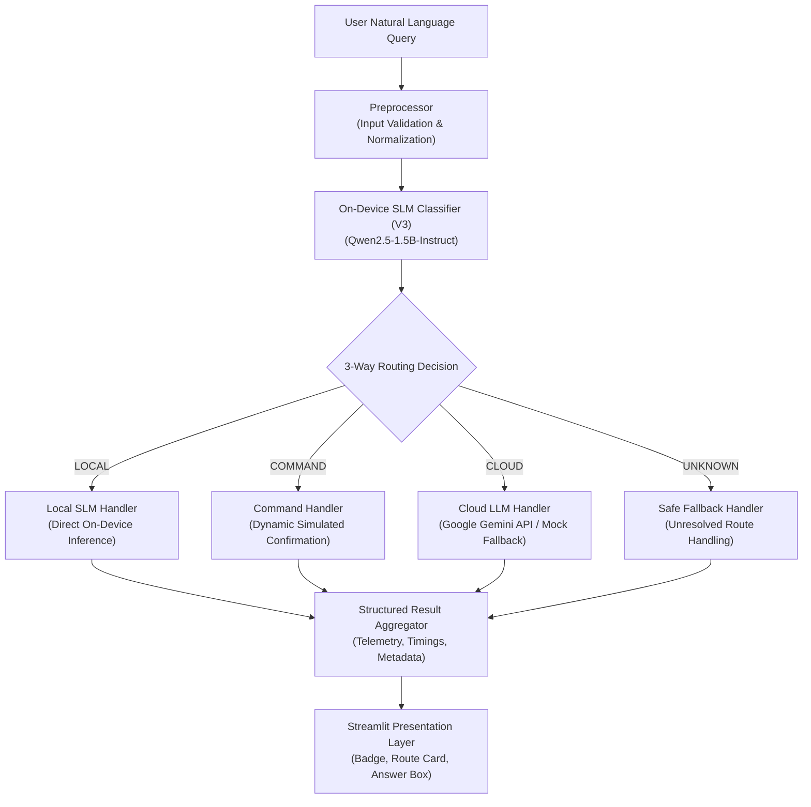
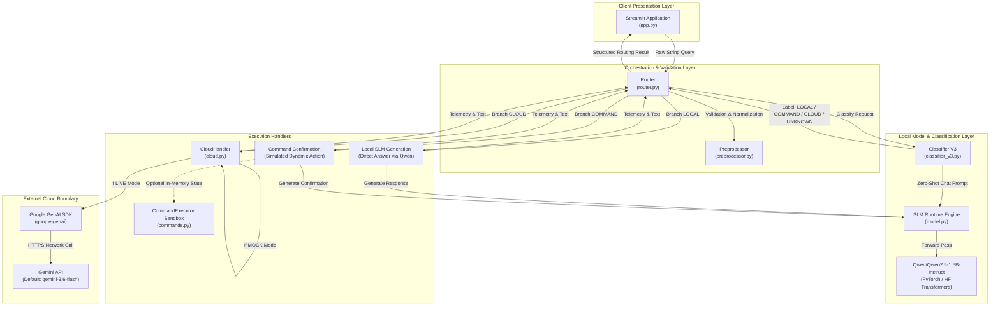
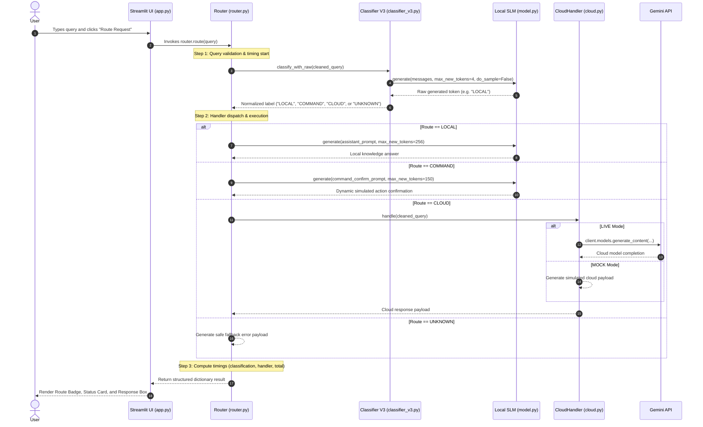
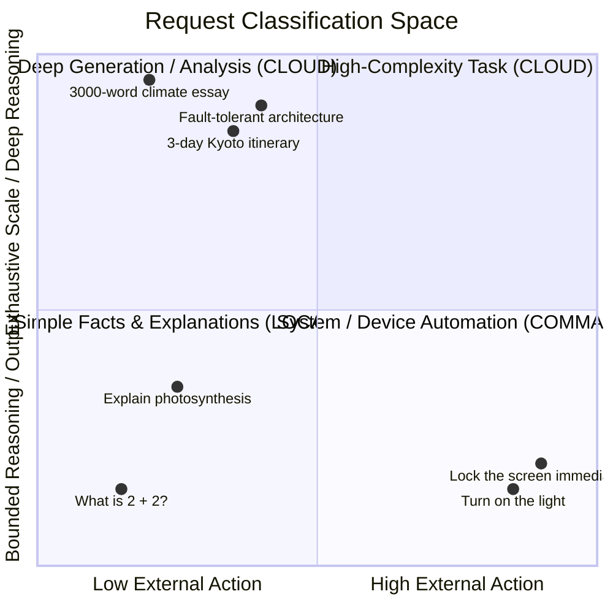
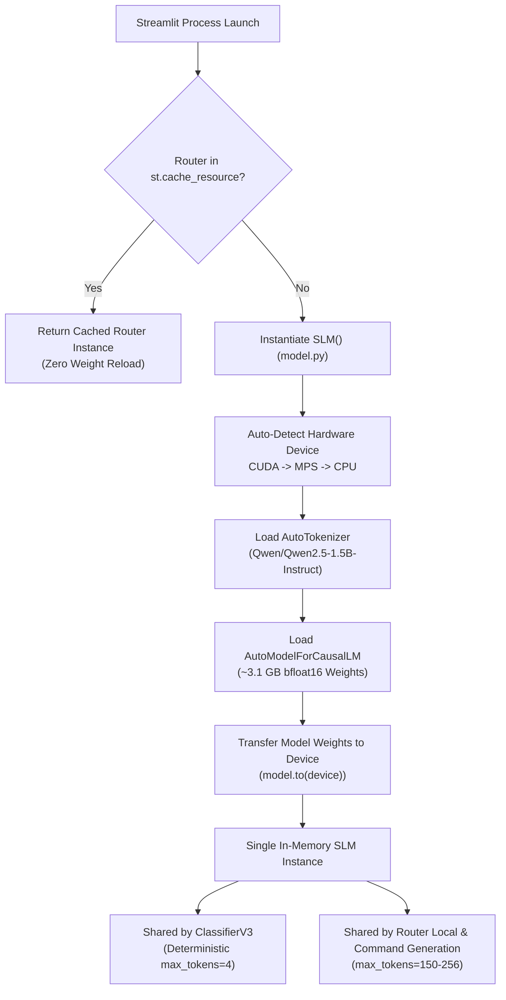
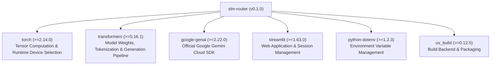
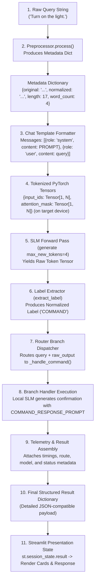
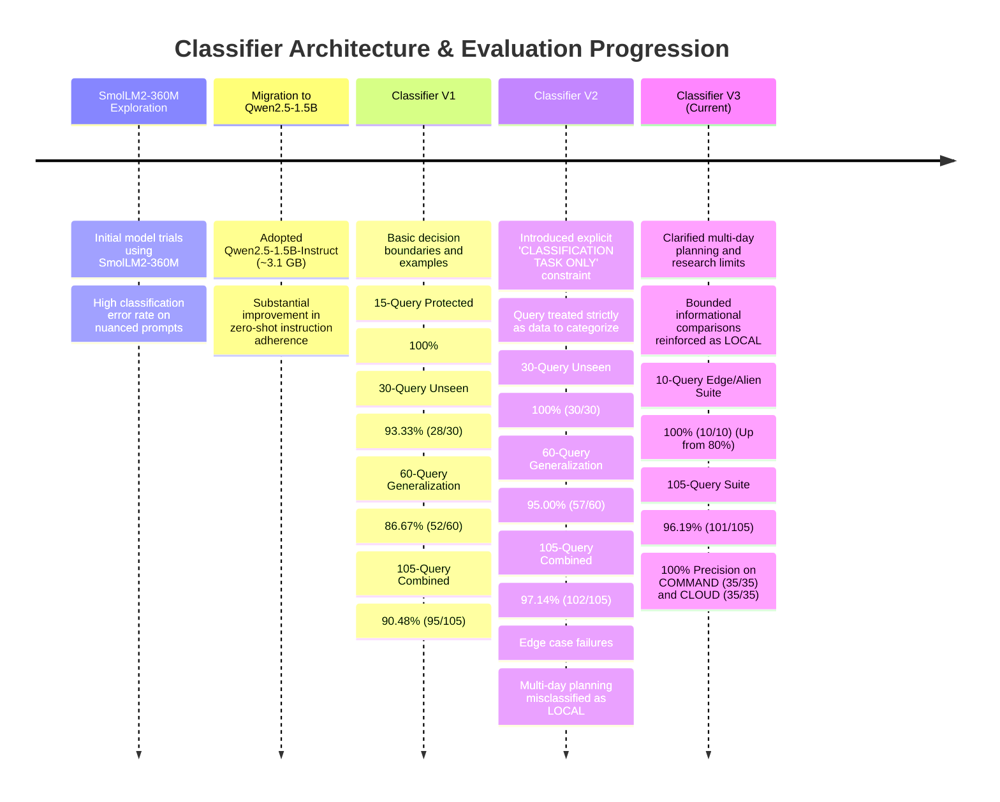

# SLM Router — System Architecture

## 1. System Overview

**SLM Router** is an on-device request classification and intelligent 3-way dispatch engine. It evaluates incoming natural language queries directly on the user's host machine using an on-device Small Language Model (SLM) and routes each query to an appropriate execution path:

1. **`LOCAL`**: Resolving bounded informational, mathematical, code snippet, and explanatory queries directly on-device with the local SLM.
2. **`COMMAND`**: Identifying physical or operating system automation intents and safely producing a dynamic simulated action confirmation on-device without executing unverified host commands.
3. **`CLOUD`**: Offloading complex, deep research, long-form authoring, or production-grade architectural design workloads to Google Gemini via the Google GenAI SDK.



### The Problem Being Solved

Contemporary generative AI architectures routinely transmit every prompt directly to remote, high-parameter cloud Large Language Models (LLMs). This universal offloading model introduces significant engineering compromises:

- **Token Cost Inefficiency**: Simple lookups (e.g., *"What is 2 + 2?"* or *"What is the boiling point of water?"*) consume paid cloud API quotas and billable input/output tokens.
- **Unnecessary Network Latency**: Basic questions incur round-trip network hops, DNS resolution, and remote queueing delays when they could be computed locally.
- **Data Privacy & Telemetry Leakage**: Private queries, local automation intents, and contextual notes leave the local workstation boundary.
- **Cloud Dependency & Resilience**: Any network interruption or cloud provider outage halts local workflow interactions.

Conversely, deploying exclusively on small local models leads to performance degradation when users request long-form technical reports, intricate multi-day schedules, or deep comparative system analyses that exceed the reasoning and parameter capacity of edge models.

SLM Router solves this dilemma by introducing a local classification layer: an on-device SLM serves as a triage gatekeeper, keeping lightweight interactions and device intents local while selectively escalating heavy tasks to cloud models.

---

## 2. High-Level Architecture

The system is organized into modular layers: presentation, orchestration, local inference, command safety simulation, and cloud integration.



### Component Relationships

- **Streamlit UI (`app.py`)** acts as the front-end interface, managing user sessions, caching the runtime engine via `@st.cache_resource`, and rendering structured execution telemetry.
- **Router (`src/slm_router/router.py`)** serves as the central orchestrator, executing the classification call, measuring execution duration via `time.perf_counter()`, and dispatching to the selected branch.
- **Classifier V3 (`src/slm_router/classifier_v3.py`)** formats a prompt that instructs the local SLM to act strictly as a categorical classifier, parsing outputs into deterministic labels.
- **Local SLM Engine (`src/slm_router/model.py`)** encapsulates the Hugging Face Transformers pipeline for `Qwen/Qwen2.5-1.5B-Instruct`, managing device detection across CUDA, MPS, and CPU.
- **Command Handling (`src/slm_router/commands.py` & `router.py`)** provides a dual-model safety layer: dynamic natural language action confirmations generated by the local SLM, alongside an in-memory device state simulator without arbitrary shell access.
- **Cloud Handler (`src/slm_router/cloud.py`)** abstracts communication with the Google Gemini API using the official `google-genai` SDK, offering automatic mock fallback and API credential redaction.

---

## 3. End-to-End Request Flow

Every user submission follows a deterministic 8-step lifecycle:



### Route-Specific Lifecycle Branches

#### 1. The `LOCAL` Branch
- **Trigger**: The classifier assigns the label `LOCAL`.
- **Handler**: `Router._handle_local()` calls `SLM.generate()`.
- **Prompt**: Formatted with `LOCAL_ASSISTANT_SYSTEM_PROMPT` (*"You are a helpful, knowledgeable, and concise AI assistant..."*).
- **Execution**: The local Qwen model generates a direct response with `max_new_tokens=256`, `do_sample=False`.
- **Output**: Returns `route: "LOCAL"`, `handler: "Local SLM"`, `mode: "LOCAL"`, and the generated answer text.

#### 2. The `COMMAND` Branch
- **Trigger**: The classifier assigns the label `COMMAND`.
- **Handler**: `Router._handle_command()` calls `SLM.generate()`.
- **Prompt**: Formatted with `COMMAND_RESPONSE_PROMPT`, instructing the model to confirm that the requested command was successfully performed, state the action, and provide a short, context-specific note without static phrasing.
- **Execution**: Executed entirely on-device with `max_new_tokens=150`, `do_sample=False`.
- **Safety**: No system shells, subprocesses, or OS API hooks are invoked. The action confirmation is simulated dynamically.
- **Output**: Returns `route: "COMMAND"`, `handler: "Local SLM"`, `action: "Action Confirmation"`, `status: "COMMAND EXECUTED"`.

#### 3. The `CLOUD` Branch
- **Trigger**: The classifier assigns the label `CLOUD`.
- **Handler**: `Router._handle_cloud()` calls `CloudHandler.handle()`.
- **Execution**:
  - **In LIVE Mode**: Instantiates `google.genai.Client(api_key=...)` and invokes `client.models.generate_content(model=self.model_name, contents=query)`.
  - **In MOCK Mode**: Generates a simulated payload indicating target model, provider, and estimated query complexity without network transit.
- **Output**: Returns `route: "CLOUD"`, `handler: "Cloud LLM"`, `status: "LIVE INFERENCE SUCCESS"` or `"READY FOR CLOUD LLM (MOCK MODE)"`.

#### 4. The `UNKNOWN` / Error Branch
- **Trigger**: The classifier output does not strictly match `LOCAL`, `COMMAND`, or `CLOUD`, or the user submits an empty query.
- **Handler**: `Router._handle_unknown()`.
- **Execution**: Prevents speculative routing or silent execution. Generates an explicit warning containing the raw classifier token for traceability.
- **Output**: Returns `route: "UNKNOWN"`, `handler: "Fallback Handler"`, `success: False`, `mode: "FALLBACK"`.

---

## 4. Component Architecture

### 4.1 `app.py`
The Streamlit application provides an interactive web interface for evaluating requests and inspecting routing decisions.

- **Initialization & Pathing**: Resolves the repository root via `Path(__file__).resolve().parent` and prepends `src/` to `sys.path` to guarantee deterministic imports regardless of the invocation directory.
- **Resource Caching**: Implements `@st.cache_resource` on `get_router()`. This ensures that `Router()`—and its underlying ~3.1 GB neural network weights—is instantiated exactly once per server process rather than reloading on every Streamlit page rerun.
- **UI Architecture**:
  - **Header**: Displays real-time operational status dots (Local SLM status, Router readiness, Cloud API configuration state).
  - **Prompt Section**: Includes a primary query text area and three pre-configured demonstration buttons (*"Turn on sprinkler"*, *"Explain ocean tides"*, *"Semiconductor analysis"*).
  - **Route Card**: Custom CSS styling dynamically color-codes decisions (Green for `LOCAL`, Amber for `COMMAND`, Purple for `CLOUD`, Red for errors) and displays execution metadata.
  - **Answer Container**: Renders model responses inside a bordered container, or displays explicit alert blocks on failure.

### 4.2 `src/slm_router/model.py`
Encapsulates Hugging Face Transformers to provide a unified inference interface over `Qwen/Qwen2.5-1.5B-Instruct`.

- **Model Specification**: Utilizes `Qwen/Qwen2.5-1.5B-Instruct` (~1.54 billion parameters, bfloat16 weights totaling ~3.1 GB on disk).
- **Device Selection**: Defines `get_default_device()` with the following priority hierarchy:
  ```
  torch.cuda.is_available()  --> torch.device("cuda")
  torch.backends.mps.is_available() --> torch.device("mps")
  Fallback                   --> torch.device("cpu")
  ```
- **Tensor Placement**: Both tokenizer inputs generated via `apply_chat_template` and model parameters are moved to `self.device` before inference.
- **Inference & Decoding**:
  - Accepts raw prompts or structured chat `messages`.
  - Executes `self.model.generate()` with explicit token limits (`max_new_tokens`) and sampling controls (`do_sample=False` by default).
  - Slices output token IDs (`outputs[0][input_length:]`) to isolate newly generated tokens from the prompt context.
  - Decodes with `skip_special_tokens=True` to strip `<|im_end|>` and formatting markers.
- **Instance Reuse**: The `SLM` class is instantiated once and passed by reference to downstream consumers, ensuring that classification and generation share the same weights in system RAM/VRAM.

### 4.3 `src/slm_router/classifier_v3.py`
Implements the active frozen V3 prompt-based query classifier.

- **Prompt Design**: Configures `CLASSIFIER_V3_SYSTEM_PROMPT`, which explicitly constrains the language model:
  - Treats the user request strictly as **input data to be categorized**.
  - Explicitly forbids answering, executing, summarizing, translating, or rewriting the request.
  - Establishes strict decision boundaries between `COMMAND` (external physical/software state changes), `CLOUD` (scale, depth, multi-day planning, long-form authoring 500+ words, production architecture), and `LOCAL` (bounded facts, definitions, simple explanations, small translations).
  - Supplies few-shot exemplar mappings for each class.
- **Deterministic Generation**: Calls `slm.generate(messages=messages, max_new_tokens=4, do_sample=False)`. Limiting output to 4 tokens prevents the model from generating conversational preambles and enforces low inference latency.
- **Label Parsing (`extract_label`)**:
  - Normalizes raw model output: `.strip().upper().rstrip(".!,:;")`.
  - Performs an exact set membership check against `VALID_LABELS = {"LOCAL", "COMMAND", "CLOUD"}`.
  - Returns `UNKNOWN` for any output that does not match the valid set. Substring matching is deliberately avoided to eliminate false-positive route classification.

### 4.4 `src/slm_router/router.py`
Serves as the central orchestration and telemetry engine.

- **Dependency Injection**: The `Router` constructor accepts optional instances of `slm`, `classifier`, `command_executor`, and `cloud_handler`. If omitted, production defaults are lazily instantiated:
  ```python
  self.slm = slm if slm is not None else SLM()
  self.classifier = classifier if classifier is not None else ClassifierV3(self.slm)
  self.commands = command_executor
  self.cloud = cloud_handler if cloud_handler is not None else CloudHandler()
  ```
- **Execution Telemetry**: Wraps classification and branch execution with `time.perf_counter()`, recording latency metrics in seconds rounded to three decimal places (`classification`, `handler`, `total`).
- **Command Handling Nuance**:
  - The default production route for commands invokes the local SLM with `COMMAND_RESPONSE_PROMPT` to produce a natural action confirmation.
  - The injected `command_executor` parameter permits swapping or augmenting this behavior with the sandbox state simulator in `commands.py`.
- **Structured Response Schema**: Returns a dictionary with guaranteed keys: `query`, `route`, `handler`, `processing_type`, `response`, `result`, `success`, `mode`, `model`, `timings`, and `details`.

### 4.5 `src/slm_router/commands.py`
Provides an in-memory simulated command execution sandbox (`CommandExecutor`).

- **Simulated State**: Maintains a dictionary tracking simulated device properties:
  ```python
  self.state = {
      "light": "OFF",
      "sprinkler": "OFF",
      "music": "PAUSED",
      "browser": "CLOSED",
      "screen": "UNLOCKED",
      "brightness": 50,
      "volume": 50,
  }
  ```
- **Pattern Matching**: Parses queries using regular expressions and keyword checks (e.g., regex extraction of duration `(\d+)\s*(minutes|seconds)` for sprinklers, percentage `(\d+)\s*%` for brightness).
- **Safe Sandboxing**: Unregistered command requests return `status: "SIMULATED REJECTION (UNREGISTERED)"` with `success: False`.
- **Absolute Shell Isolation**: `commands.py` contains no operating system bindings. No calls to `subprocess`, `os.system`, `os.popen`, `eval`, or `exec` exist within the codebase.

### 4.6 `src/slm_router/cloud.py`
Encapsulates cloud model routing via Google Gemini.

- **SDK Integration**: Utilizes the modern `google-genai` SDK (`from google import genai`).
- **Configuration Defaults**:
  - `CLOUD_MODEL`: Defaults to `gemini-3.6-flash` (configurable via environment variable).
  - `CLOUD_MODE`: Evaluated from `os.getenv("CLOUD_MODE", "")`. If `GEMINI_API_KEY` is missing or empty, the handler automatically defaults to `"mock"` mode.
- **Mock Mode**: Generates a structured demonstration dictionary including target model metadata and estimated complexity without issuing network requests.
- **Credential Sanitization (`_sanitize_error_message`)**: Intercepts exception strings and replaces any occurrence of `self.api_key` with `[REDACTED_API_KEY]` before returning errors to callers or the UI.
- **Error Taxonomy**: Categorizes Gemini API exceptions into clear error types:
  - `errors.ClientError` (Codes 400, 401, 403) $\rightarrow$ Authentication / Authorization Error.
  - `errors.ClientError` (Code 429 / `RESOURCE_EXHAUSTED`) $\rightarrow$ Rate Limit / Quota Exceeded.
  - `errors.ServerError` (Codes 5xx) $\rightarrow$ Cloud Provider Server Error.
  - `errors.APIError` $\rightarrow$ General API Error.

### 4.7 `src/slm_router/preprocessor.py`
Performs input sanitation and extracts query metadata.

- **Validation**: Enforces that input is a valid string (`TypeError`) and is non-empty after stripping whitespace (`ValueError`).
- **Metadata Extraction**: Computes and returns a dictionary:
  ```python
  {
      "original": query,
      "normalized": query.lower(),
      "length": len(query),
      "word_count": len(query.split()),
  }
  ```
- **Architectural Clarification**: The extracted `length` and `word_count` fields are telemetry metadata. Query length and word count are **not** used as hard-coded heuristic thresholds for routing; classification decisions are made exclusively by the SLM classifier.

---

## 5. Request Classification Logic

The V3 classification prompt establishes explicit semantic boundaries across three functional domains:



### 1. `LOCAL`
Reserved for bounded informational, factual, or lightweight content generation tasks that fit comfortably within the context and reasoning limits of a 1.5-billion-parameter model:
- Factual queries (*"What is the capital of India?"*)
- Conceptual definitions and concise explanations (*"What is TCP?"*, *"Explain photosynthesis in simple terms."*)
- Basic arithmetic and logic (*"What is 2 + 2?"*)
- Simple programming syntax (*"Write a Python function that adds two numbers."*)
- Short transformations and greetings (*"Write a short birthday greeting message."*, *"Translate 'hello' into French."*)

### 2. `COMMAND`
Applies whenever the user intends for an external system, operating system, appliance, or application to **perform an action or alter state**, rather than simply returning descriptive text.

The classifier is explicitly designed to distinguish an **imperative command** from an **informational query about a command**:

| Imperative Action Intent (`COMMAND`) | Informational Inquiry (`LOCAL`) |
|---|---|
| *"Turn on the light."* | *"Explain how to turn on a light."* |
| *"Open the door."* | *"How do I open a door?"* |
| *"Launch the browser."* | *"What is a web browser?"* |
| *"Lock the screen immediately."* | *"How do I configure screen lock settings?"* |
| *"Turn the garden sprinkler on for 15 minutes."* | *"How much water does a garden sprinkler use?"* |

If the intended outcome is for the host environment or external hardware to **do** something, the classification is `COMMAND`.

### 3. `CLOUD`
Reserved for workloads whose scale, reasoning depth, research breadth, or output volume exceed the parameter and context budget of an on-device SLM:
- Long-form prose and reports (*"Write a 3000-word essay about climate change."*, *"Tell me a 500-word story about a dragon."*)
- Exhaustive research and analysis (*"Write a detailed research report about quantum computing."*, *"Analyze the economic impact of artificial intelligence in detail."*)
- Multi-day planning and logistical schedules (*"Plan a comprehensive multi-day travel itinerary with daily schedules and logistics."*)
- Production-grade system architecture (*"Develop a detailed production-ready distributed system architecture."*)

Classification is based on the **inherent complexity of the task**, rather than simple keyword matching. For instance, a query starting with the verb *"Plan"* is routed to `LOCAL` if it involves simple tasks (*"Plan a simple dinner for two"*), but escalates to `CLOUD` when it requires multi-day logistics (*"Plan a three-day itinerary for exploring Kyoto during cherry blossom season"*).

---

## 6. Model Architecture and Lifecycle

The model management layer balances inference accuracy against memory footprint.



### Lifecycle Mechanics

1. **Lazy Loading**: The model weights are loaded upon the first call to `SLM()`, typically triggered when Streamlit initializes `get_router()`.
2. **Device Detection**: `get_default_device()` queries the PyTorch runtime to select `cuda` (NVIDIA GPUs), `mps` (Apple Silicon Metal Performance Shaders), or `cpu` (standard fallback).
3. **Weight Sharing**: A single instance of `SLM` is retained in memory. When a request arrives:
   - `ClassifierV3` uses the shared instance to run a forward pass with `max_new_tokens=4`.
   - If routed to `LOCAL` or `COMMAND`, the same shared instance generates the response text.
   This avoids holding multiple copies of the model in memory, keeping total RAM consumption near the ~3.1 GB weight baseline.
4. **Chat Template Formatting**: The system formats prompts using `tokenizer.apply_chat_template(messages, add_generation_prompt=True, return_tensors="pt")`.
5. **Colocation & Slicing**:
   ```python
   inputs = {k: v.to(self.device) if hasattr(v, "to") else v for k, v in inputs.items()}
   outputs = self.model.generate(**inputs, max_new_tokens=max_new_tokens, do_sample=do_sample)
   input_length = inputs["input_ids"].shape[1]
   generated_tokens = outputs[0][input_length:]
   response = self.tokenizer.decode(generated_tokens, skip_special_tokens=True).strip()
   ```
   Isolating output tokens by indexing from `input_length` ensures prompt tokens are not repeated in the decoded output string.

---

## 7. Cloud Integration Architecture

The cloud subsystem provides an escalation path for high-complexity queries while maintaining local safety boundaries.

```mermaid
flowchart LR
    subgraph Host ["Local Workstation Boundary"]
        Query["User Query"] --> Router["Router"]
        Router --> CloudHandler["CloudHandler (cloud.py)"]
        CloudHandler --> ModeCheck{"Mode == LIVE<br/>& Key Present?"}
        ModeCheck -->|No| MockPath["_handle_mock()<br/>(Simulated Cloud Payload)"]
        ModeCheck -->|Yes| LivePath["_handle_live()<br/>(Official GenAI Client)"]
        Sanitizer["Error Sanitizer<br/>(_sanitize_error_message)"]
    end

    subgraph Cloud ["Google Cloud Boundary"]
        LivePath -->|HTTPS API Call| GenAIEndpoint["Google Gemini API<br/>(gemini-3.6-flash)"]
        GenAIEndpoint -->|Inference Result| LivePath
        GenAIEndpoint -.->|Exceptions (401, 429, 5xx)| Sanitizer
    end

    Sanitizer --> CloudHandler
    MockPath --> Router
    LivePath --> Router
```

### Operational Modes

- **Live Mode (`CLOUD_MODE=live`)**:
  - Requires a valid `GEMINI_API_KEY`.
  - Initializes `genai.Client(api_key=self.api_key)`.
  - Dispatches the request via `client.models.generate_content(model=self.model_name, contents=query)`.
  - Extracts generated content from `response.text`.
- **Mock Mode (`CLOUD_MODE=mock`)**:
  - Automatically activated if `GEMINI_API_KEY` is missing or if `CLOUD_MODE` is explicitly set to `mock`.
  - Avoids network connections and external API quota usage.
  - Constructs a mock payload detailing target provider, model, and query complexity classification for testing and offline demonstrations.

### Security & Redaction

The application redacts sensitive credentials from its outputs:
- The API key is passed directly from environment variables to the Google client; it is never logged or displayed in UI cards.
- If the Gemini SDK raises an exception (e.g., authentication failures or network errors), `_sanitize_error_message` checks for the API key in the error string and redacts it with `[REDACTED_API_KEY]` before the error message is propagated.

---

## 8. Configuration and Environment

Runtime settings are managed through environment variables using `python-dotenv`.

### Environment Variables

| Variable | Type | Default Value | Description |
|---|---|---|---|
| `GEMINI_API_KEY` | String | `""` (Empty) | Google AI Studio API key for live cloud calls. If empty, the system falls back to mock mode. |
| `CLOUD_MODEL` | String | `gemini-3.6-flash` | Identifier of the Gemini model used for cloud offloading. |
| `CLOUD_MODE` | String | `mock` (if no key) / `live` | Operational mode (`live` for real API calls, `mock` for local simulation). |

### Template Configuration (`.env.example`)

```ini
GEMINI_API_KEY=your-api-key-here
CLOUD_MODEL=gemini-3.6-flash
CLOUD_MODE=live
```

> [!IMPORTANT]
> The active `.env` file contains sensitive API credentials and is excluded from source control by `.gitignore`. Only the sanitized template `.env.example` should be committed.

---

## 9. Dependency Architecture

Dependencies are managed using [`uv`](https://docs.astral.sh/uv/) and locked in `uv.lock`.



| Package | Version Constraint | Responsibility |
|---|---|---|
| `torch` | `>=2.14.0` | Tensor manipulation, hardware backends (CUDA, MPS, CPU), and neural network execution. |
| `transformers` | `>=5.16.1` | Hugging Face ecosystem bindings, AutoTokenizer, AutoModelForCausalLM, and chat template engines. |
| `google-genai` | `>=2.22.0` | Official Google Gemini API client SDK. |
| `streamlit` | `>=1.63.0` | Web dashboard, reactive state management, and asset caching. |
| `python-dotenv` | `>=1.2.3` | Parsing configuration variables from local `.env` files. |
| `uv` / `uv_build` | `>=0.12.5` | Fast Python package resolution, virtual environment creation, and project builds. |

---

## 10. Testing Architecture

The test suite covers unit logic, routing orchestration, cloud handling, safety boundaries, and classification benchmarks:

```
src/slm_router/tests/
├── test_router.py              # Unit tests for routing and dangerous pattern safety checks
├── test_phase3.py              # CloudHandler unit tests and timing measurements
├── test_preprocessor.py        # Input sanitation and metadata extraction checks
├── test_intent.py              # Historical binary intent classifier verification
├── test_model.py               # SLM loading and basic text generation smoke tests
├── test_classifier.py          # 15-query baseline classification test
├── test_classifier_v2.py       # V2 classifier evaluation runner
├── test_generalization_60.py   # 60-query generalization benchmark
├── compare_v1_v2.py            # Comparative evaluation harness (V1 vs V2 across 105 queries)
├── compare_v2_v3.py            # Comparative evaluation harness (V2 vs V3 across 105 queries + 10 alien queries)
└── capability_benchmark.py     # Comprehensive model capability benchmark across 120 prompts
```

### Key Test Guarantees

1. **Unit & Orchestration Validation (`test_router.py`)**:
   - Mocks the classifier and SLM to verify routing branches (`LOCAL`, `COMMAND`, `CLOUD`) without reloading model weights.
   - Asserts input query preservation, trimming, and structured dictionary output compliance.
   - Validates dynamic command confirmation handling.
2. **Safety Pattern Scanning (`test_router.py`)**:
   - `test_no_arbitrary_shell_execution_possible` reads `commands.py` and `router.py` from disk and scans for dangerous execution patterns (`import subprocess`, `from subprocess`, `os.system`, `os.popen`, `shell=True`, `exec(`, `eval(`). The test fails if any shell execution patterns are introduced.
3. **Cloud Integration & Credential Protection (`test_phase3.py`)**:
   - Verifies default fallback to `mock` mode when credentials are missing.
   - Mocks `google.genai.Client` to validate live cloud payload processing.
   - Tests `_sanitize_error_message` by verifying that raw API key strings do not appear in structured results or error payloads.
   - Checks that routing results record non-negative floating-point execution timings (`classification`, `handler`, `total`).
4. **Fast Discovered Test Execution**:
   - The discovered unit test suite (`unittest discover -s src/slm_router/tests -p "test_*.py"`) runs 15 mock-isolated test cases in under 2 seconds.

---

## 11. Portability Architecture

The system supports cross-platform execution through centralized device detection in `src/slm_router/model.py`:

```
Runtime Device Selection Order:
1. NVIDIA CUDA   -->  torch.cuda.is_available()
2. Apple Silicon -->  hasattr(torch.backends, "mps") and torch.backends.mps.is_available()
3. CPU Fallback  -->  torch.device("cpu")
```

### Technical Portability Features

- **Co-located Tensors**: Input tensors generated by the tokenizer and model weights are moved to the same target device before inference, preventing cross-device runtime errors.
- **Default Precision Loading**: Model weights are loaded in their native precision without hard-coded floating-point casts (such as forcing `float16` on devices lacking hardware half-precision support), ensuring stable CPU execution.
- **Anchored File Paths**: Path operations across the codebase use `pathlib.Path(__file__).resolve()` to ensure consistent execution regardless of current working directory.

### Hardware Validation Status

| Platform & Environment | Hardware / Accelerator | Status | Notes |
|---|---|---|---|
| **macOS (Apple Silicon)** | Apple M-Series (MPS / Metal) | **Physically Tested & Verified** | Primary development and testing environment; validated on MPS and CPU fallback. |
| **Linux (x86_64)** | NVIDIA GPU (CUDA) | **Designed & Architecturally Supported** | Supported by runtime logic; physical hardware validation pending. |
| **Linux (x86_64)** | CPU | **Designed & Architecturally Supported** | Supported by CPU fallback; physical hardware validation pending. |
| **Windows (x86_64)** | NVIDIA GPU (CUDA) / CPU | **Designed & Architecturally Supported** | Pathlib-compliant; physical hardware validation pending. |
| **Linux (ARM64 / Raspberry Pi)** | ARM Cortex CPU | **Untested Deployment Target** | Architecturally prepared for CPU fallback; not physically tested on Raspberry Pi hardware. |

---

## 12. Security and Safety Boundaries

The application enforces specific safety boundaries for prototype deployment:

1. **No Arbitrary Shell Execution**: The application does not execute operating system shell commands or launch external binaries. Neither `subprocess`, `os.system`, nor dynamic code execution (`eval`/`exec`) is used in the execution path.
2. **Simulated Action Sandbox**: The `COMMAND` branch is strictly simulated. It either returns a generated natural-language action confirmation or updates an in-memory dictionary in `commands.py`.
3. **Environment-Isolated Secrets**: API keys are loaded via `os.getenv` from local `.env` files. The repository includes `.gitignore` patterns protecting `.env` from accidental commits.
4. **Credential Redaction in Logs**: Cloud exception strings are sanitized through `_sanitize_error_message()` to replace raw API keys with `[REDACTED_API_KEY]`.
5. **Exact Match Label Parsing**: Model generation is constrained to 4 tokens, and `extract_label` requires an exact match against `{"LOCAL", "COMMAND", "CLOUD"}`. Unrecognized outputs safely default to `UNKNOWN`.
6. **Graceful Degraded State**: Missing network connectivity or unset cloud API keys trigger mock mode fallbacks rather than unhandled process termination.

---

## 13. Error Handling and Failure Modes

The system provides structured fallbacks across failure scenarios:

| Failure Scenario | Detection Mechanism | System Behavior | User-Facing Result |
|---|---|---|---|
| **Empty or Whitespace-Only Query** | `Router.route()` checks `cleaned_query = query.strip()` | Bypasses classification and generation; immediately returns an `UNKNOWN` route dictionary. | UI displays warning: *"Please enter a request before routing."* |
| **Classifier Returns Unrecognized Label** | `extract_label()` fails set membership in `{"LOCAL", "COMMAND", "CLOUD"}` | Returns `route: "UNKNOWN"` and routes request to `_handle_unknown()`. | Displays red route card indicating an unclassified request along with the raw model token. |
| **Missing Cloud API Key in Live Mode** | `CloudHandler.__init__()` detects empty `GEMINI_API_KEY` | Automatically switches `mode = "mock"`; marks API status as `"Not Configured"`. | Returns simulated cloud routing payload without raising errors. |
| **Invalid or Revoked Gemini API Key** | `google.genai.errors.ClientError` with HTTP 400/401/403 | Intercepts exception, strips API keys, and sets `mode = "ERROR"`. | Displays clean error message: *"Authentication Error: Invalid or unauthorized Gemini API key."* |
| **Cloud Quota Exceeded (Rate Limit)** | `google.genai.errors.ClientError` with HTTP 429 (`RESOURCE_EXHAUSTED`) | Intercepts exception and classifies as rate limiting. | Displays error: *"Rate Limit / Quota Exceeded: Your Gemini API quota has been exceeded."* |
| **Remote Cloud Service Unavailable** | `google.genai.errors.ServerError` with HTTP 5xx | Intercepts exception and formats server error status. | Displays error: *"Gemini Server Error (5xx): [Sanitized Error Details]"*. |
| **Local Model Out of Memory (OOM)** | PyTorch runtime exception | Uncaught at router layer; caught at process level. | Process fails gracefully if OS memory is exhausted; mitigated by small footprint (~3.1 GB). |

---

## 14. Data Flow

Data flows through the system as structured objects across pipeline stages:



### Data Payload Structures

#### Input to Branch Handlers:
```python
query: str = "Turn the garden sprinkler on for 15 minutes."
raw_output: str = "COMMAND"
```

#### Final Structured Result Dictionary (`Router.route()` output):
```python
{
    "query": "Turn the garden sprinkler on for 15 minutes.",
    "route": "COMMAND",
    "handler": "Local SLM",
    "processing_type": "command",
    "action": "Action Confirmation",
    "status": "COMMAND EXECUTED",
    "response": "The garden sprinkler has been activated for 15 minutes. Your lawn watering schedule is underway.",
    "result": "The garden sprinkler has been activated for 15 minutes. Your lawn watering schedule is underway.",
    "success": True,
    "mode": "LOCAL",
    "model": "Qwen/Qwen2.5-1.5B-Instruct",
    "timings": {
        "classification": 0.048,
        "handler": 0.212,
        "total": 0.260
    },
    "details": {
        "model": "Qwen/Qwen2.5-1.5B-Instruct",
        "classification_token": "COMMAND",
        "status": "EXECUTED_DYNAMICALLY",
        "success": True
    }
}
```

---

## 15. Design Decisions

### 1. Why a Local SLM Gatekeeper?
Evaluating queries directly on-device keeps lightweight queries private and local, avoiding unnecessary cloud API costs and network latency.

### 2. Why `Qwen/Qwen2.5-1.5B-Instruct`?
Early iterations of the project used `HuggingFaceTB/SmolLM2-360M-Instruct`. While lightweight, the 360M parameter model struggled with consistent zero-shot constraint following and multi-class prompt instruction obedience. Transitioning to `Qwen2.5-1.5B-Instruct` resolved these instruction-following issues while maintaining a compact ~3.1 GB memory footprint suitable for local CPU and Apple Silicon MPS execution.

### 3. Why 3-Way Classification (`LOCAL` vs `COMMAND` vs `CLOUD`)?
Binary classification (e.g., local vs. cloud) overlooks device automation intents. The 3-way split isolates three distinct execution requirements:
- Informational requests answered directly by the local SLM.
- Device control actions handled by safe local automation.
- High-complexity generation tasks escalated to cloud models.

### 4. Why Prompt-Based Classification Instead of Fine-Tuning?
Prompt-based classification allows for fast iteration and prompt refinement without the overhead of maintaining fine-tuned LoRA checkpoints. Combining system prompts, explicit decision boundaries, and few-shot examples proved sufficient to achieve over 96% accuracy on evaluation suites.

### 5. Why Deterministic Generation (`do_sample=False`)?
Setting `do_sample=False` ensures greedy token selection. This eliminates random sampling variations, ensuring consistent classification labels across repeated runs of the same query.

### 6. Why Exact Label Parsing?
Heuristic substring parsing (e.g., checking if `"LOCAL"` is present within a conversational response) can lead to false positives when models produce descriptive text. Restricting output to 4 tokens and requiring an exact match against `{"LOCAL", "COMMAND", "CLOUD"}` guarantees that ungrounded text falls back safely to `UNKNOWN`.

### 7. Why Dependency Injection in `Router`?
Decoupling the `Router` class from its dependencies enables unit tests to inject mock classifiers and handlers. This allows the routing logic and test suite to run in seconds without loading the ~3.1 GB model weights into memory.

---

## 16. Evaluation and Development Evolution

The classifier underwent three major development iterations, tracked across benchmark suites in `src/slm_router/tests/`:



### Documented Empirical Evaluation Data

The repository records comparative evaluations across four standardized query suites:
1. **Protected Benchmark (15 queries)**: 5 Local, 5 Command, 5 Cloud.
2. **Existing Unseen Benchmark (30 queries)**: 10 Local, 10 Command, 10 Cloud.
3. **Generalization Benchmark (60 queries)**: 20 Local, 20 Command, 20 Cloud.
4. **Edge / Alien Suite (10 queries)**: Edge cases testing planning, comparisons, and device intents.

#### Empirical Benchmark Comparison

| Benchmark Suite | V1 Baseline | V2 Baseline | V3 Candidate (Current) |
|---|---|---|---|
| **Protected Benchmark (15 queries)** | 15/15 (100.00%) | 15/15 (100.00%) | **15/15 (100.00%)** |
| **Existing Unseen (30 queries)** | 28/30 (93.33%) | 30/30 (100.00%) | **30/30 (100.00%)** |
| **Generalization (60 queries)** | 52/60 (86.67%) | 57/60 (95.00%) | **56/60 (93.33%)** |
| **Combined 105-Query Total** | **95/105 (90.48%)** | **102/105 (97.14%)** | **101/105 (96.19%)** |
| **Edge / Alien 10 Queries Suite** | Not Evaluated | 8/10 (80.00%) | **10/10 (100.00%)** |

#### V3 Confusion Matrix Across 105 Benchmark Queries

```
True \ Pred      LOCAL    COMMAND      CLOUD    UNKNOWN
LOCAL               31          0          1          3
COMMAND              0         35          0          0
CLOUD                0          0         35          0
```

#### Key Findings Across Iterations

- **V1 $\rightarrow$ V2**: Adding the explicit directive *"This is a classification task only. Never execute, perform, answer, summarize, translate, calculate, or rewrite the request"* resolved 7 classification errors, raising overall accuracy from 90.48% to 97.14%.
- **V2 $\rightarrow$ V3**: V2 misclassified multi-day planning queries (e.g., *"Plan a three-day itinerary for exploring Kyoto during cherry blossom season"*) as `LOCAL` due to the verb *"Plan"*, and misclassified factual comparisons (*"Compare the nutritional differences between lentils and chickpeas"*) as `CLOUD`. V3 refined these boundaries, achieving 10/10 (100%) on the edge query suite while maintaining 100% precision on `COMMAND` and `CLOUD`.
- **Known V3 Edge Case**: On the prompt *"Capitalize the first letter of each word in 'data science institute'"*, the model attempted to perform the capitalization transformation instead of outputting the label, yielding raw output `[DATA SCIENCE IN]` and safely falling back to `UNKNOWN`.

---

## 17. Current Limitations

1. **Simulated Command Execution**: The `COMMAND` route does not interface with physical IoT devices, operating system APIs, or home automation systems. All actions are simulated on-device via dynamic language generation or in-memory state updates.
2. **Memory Requirements**: `Qwen/Qwen2.5-1.5B-Instruct` requires approximately 3.1 GB of RAM for model weights, plus runtime activation memory. Running on systems with less than 4 GB of available system memory will lead to memory pressure or paging.
3. **Hardware-Dependent Inference Latency**: Inference speeds vary across hardware backends. Performance on Apple Silicon (MPS) or NVIDIA GPUs (CUDA) will be substantially faster than CPU-only execution on constrained edge devices.
4. **Cloud Dependency for Live Escalation**: When running in live mode (`CLOUD_MODE=live`), the cloud path requires an active internet connection and available Google Gemini API quota.
5. **Prompt-Based Sensitivity**: The classifier relies on prompt formatting and instruction adherence. Adversarial prompts or ambiguous requests may lead to `UNKNOWN` fallbacks.
6. **Physical Testing Scope**: Physical validation in the repository has been conducted primarily on macOS Apple Silicon. Linux and Windows execution environments are supported by architecture design but have not undergone physical hardware benchmarking.

---

## 18. Future Extensions

> [!NOTE]
> The features listed below are potential future enhancements and are **not currently implemented** in the active codebase.

- **Edge Hardware Benchmarks**: Running formal latency, memory, and throughput benchmarks on dedicated Linux x86_64 servers and physical Raspberry Pi 5 (8 GB) boards.
- **Model Quantization**: Adding support for 4-bit and 8-bit quantized model weights (e.g., AWQ, GPTQ, or GGUF via `llama.cpp`) to reduce the working memory footprint below 1.5 GB for constrained edge hardware.
- **Dedicated Token Classification Head**: Exploring fine-tuned sequence classification heads over the base model to replace generation-based classification with direct logit evaluation.
- **External Automation Integrations**: Providing opt-in, user-confirmed integrations with external device APIs (such as Home Assistant REST endpoints or local OS automation hooks).
- **Multi-Cloud Provider Support**: Extending the cloud layer to support alternate cloud providers (e.g., Anthropic Claude, OpenAI, or local Ollama endpoints).
- **Production Observability**: Adding OpenTelemetry hooks for tracing request flows, latency distributions, and routing decisions across production deployments.

---

## 19. Repository Structure

```
SLM-Router/
├── app.py                              # Streamlit web application and UI presentation layer
├── pyproject.toml                      # Project metadata, dependencies, and build configuration
├── uv.lock                             # Deterministic dependency lockfile
├── .env.example                        # Template for environment configuration variables
├── .gitignore                          # Excludes local environments (.venv), caches, and .env
├── README.md                           # Project overview, quickstart, and developer documentation
├── evaluations.json                    # Historical sample evaluation records
├── docs/
│   └── ARCHITECTURE.md                 # System architecture specification (this document)
├── src/
│   └── slm_router/
│       ├── __init__.py                 # Package version definition (v0.1.0)
│       ├── model.py                    # Unified SLM loader with CUDA / MPS / CPU device detection
│       ├── classifier_v3.py            # Active frozen V3 prompt-based query classifier
│       ├── classifier_v2.py            # V2 classifier implementation used for comparative evaluation
│       ├── classifier.py               # V1 classifier baseline implementation
│       ├── router.py                   # Central 3-way request router and execution orchestrator
│       ├── commands.py                 # Simulated command execution sandbox and in-memory state
│       ├── cloud.py                    # Google Gemini cloud integration, mock fallback, error sanitizer
│       ├── preprocessor.py             # Input validation, normalization, and metadata extractor
│       ├── intent.py                   # Early binary intent detector (COMMAND vs NON-COMMAND)
│       └── tests/                      # Test suite, evaluations, and capability benchmarks
│           ├── test_router.py          # Unit tests for router logic and shell safety patterns
│           ├── test_phase3.py          # Unit tests for cloud handler, mock mode, and timings
│           ├── test_preprocessor.py    # Preprocessor validation checks
│           ├── test_model.py           # Model loading smoke test
│           ├── test_intent.py          # Intent detector verification
│           ├── test_classifier.py      # 15-query baseline classification test
│           ├── test_classifier_v2.py   # V2 classifier evaluation runner
│           ├── test_generalization_60.py # 60-query generalization benchmark
│           ├── compare_v1_v2.py        # 105-query V1 vs V2 comparative evaluation script
│           ├── compare_v2_v3.py        # 105-query V2 vs V3 comparative evaluation script
│           ├── capability_benchmark.py # 120-query model capability benchmark harness
│           ├── test_model_capacity.py  # Model capacity evaluation script
│           ├── label_dataset.py        # Dataset labeling utility
│           └── data/                   # Benchmark datasets
│               ├── capability_dataset.jsonl
│               └── capability_labeled.jsonl
└── tests/
    └── test_classifier.py              # Root-level 15-query classification test suite
```

---

## 20. Quick Technical Summary

| Architectural Layer | Component File | Implementation Mechanism | Primary Responsibility |
|---|---|---|---|
| **Presentation** | [`app.py`](file:///Users/pawaneswaran/Desktop/Work/PROJECTS/SLM-Classifier/SLM-Router/app.py) | Streamlit (`st.cache_resource`, custom CSS) | Provides user interface, manages sessions, caches engine, displays routing metadata. |
| **Validation** | [`src/slm_router/preprocessor.py`](file:///Users/pawaneswaran/Desktop/Work/PROJECTS/SLM-Classifier/SLM-Router/src/slm_router/preprocessor.py) | String normalization & metadata parsing | Validates non-empty input; produces length and word count telemetry. |
| **Orchestration** | [`src/slm_router/router.py`](file:///Users/pawaneswaran/Desktop/Work/PROJECTS/SLM-Classifier/SLM-Router/src/slm_router/router.py) | Dependency injection & `time.perf_counter` | Orchestrates classification, records latency timings, dispatches to execution branches. |
| **Classification** | [`src/slm_router/classifier_v3.py`](file:///Users/pawaneswaran/Desktop/Work/PROJECTS/SLM-Classifier/SLM-Router/src/slm_router/classifier_v3.py) | Prompt engineering & exact label matching | Classifies queries into `LOCAL`, `COMMAND`, `CLOUD`, or `UNKNOWN` using 4-token greedy decoding. |
| **Local Model** | [`src/slm_router/model.py`](file:///Users/pawaneswaran/Desktop/Work/PROJECTS/SLM-Classifier/SLM-Router/src/slm_router/model.py) | Hugging Face Transformers & PyTorch | Loads `Qwen2.5-1.5B-Instruct`; detects CUDA $\rightarrow$ MPS $\rightarrow$ CPU; handles token generation. |
| **Command Safety** | [`src/slm_router/commands.py`](file:///Users/pawaneswaran/Desktop/Work/PROJECTS/SLM-Classifier/SLM-Router/src/slm_router/commands.py) | In-memory dictionary sandbox & regex matching | Simulates device state changes safely; isolates host from arbitrary shell execution. |
| **Cloud Integration** | [`src/slm_router/cloud.py`](file:///Users/pawaneswaran/Desktop/Work/PROJECTS/SLM-Classifier/SLM-Router/src/slm_router/cloud.py) | Google GenAI SDK (`google-genai`) | Routes complex workloads to Gemini (`gemini-3.6-flash`); provides mock mode and redacts API keys. |
| **Configuration** | [`.env.example`](file:///Users/pawaneswaran/Desktop/Work/PROJECTS/SLM-Classifier/SLM-Router/.env.example) | `python-dotenv` | Defines runtime configuration template for keys, models, and operational modes. |
| **Safety Testing** | [`src/slm_router/tests/test_router.py`](file:///Users/pawaneswaran/Desktop/Work/PROJECTS/SLM-Classifier/SLM-Router/src/slm_router/tests/test_router.py) | Static AST / dangerous pattern scanning | Verifies absence of `subprocess`, `os.system`, `os.popen`, `eval`, and `exec` in execution files. |
| **Unit Testing** | [`src/slm_router/tests/test_phase3.py`](file:///Users/pawaneswaran/Desktop/Work/PROJECTS/SLM-Classifier/SLM-Router/src/slm_router/tests/test_phase3.py) | Python `unittest` & `unittest.mock` | Validates mock cloud handling, error taxonomy, timing recording, and API key redaction. |
