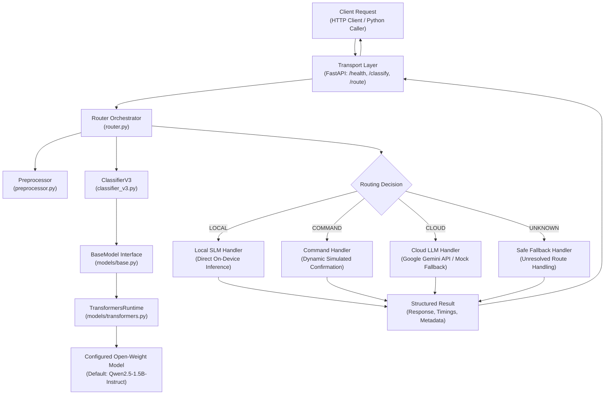
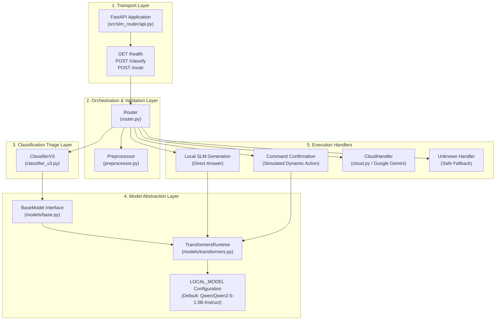
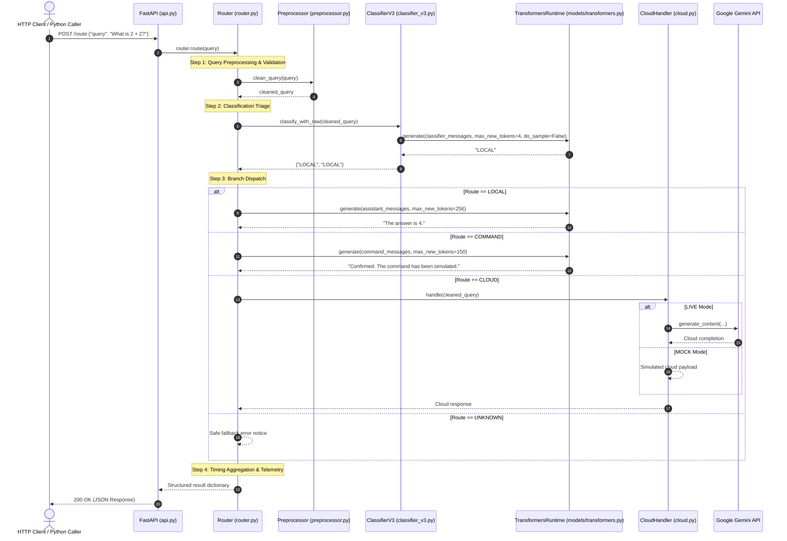

# SLM Router — System Architecture

## 1. System Overview

**SLM Router** is an on-device request classification and intelligent 3-way dispatch engine. It evaluates incoming natural language queries on the user's host machine using an on-device Small Language Model (SLM) and routes each query to an appropriate execution path:

1. **`LOCAL`**: Resolving bounded informational, mathematical, code snippet, and explanatory queries directly on-device with the local causal language model.
2. **`COMMAND`**: Identifying physical or operating system automation intents and safely producing a dynamic simulated action confirmation on-device without executing unverified host commands.
3. **`CLOUD`**: Offloading complex, deep research, long-form authoring, or production-grade architectural design workloads to Google Gemini via the Google GenAI SDK.



### The Problem Being Solved

Contemporary generative AI architectures routinely transmit every prompt directly to remote, high-parameter cloud Large Language Models (LLMs). This introduces major engineering compromises:
- **Token Cost Inefficiency**: Simple lookups (e.g., *"What is 2 + 2?"*) consume paid cloud API quotas and billable tokens.
- **Unnecessary Network Latency**: Basic questions incur round-trip network hops and remote queueing delays when they could be computed locally.
- **Data Privacy & Telemetry Leakage**: Private queries and local automation intents leave the local workstation boundary.
- **Cloud Dependency & Resilience**: Any network interruption halts workflow interactions.

Conversely, deploying exclusively on small local models leads to performance degradation when users request long-form technical reports, intricate multi-day schedules, or deep comparative system analyses.

SLM Router solves this by introducing a local classification triage: an on-device SLM serves as a gatekeeper, keeping lightweight interactions and device intents local while selectively escalating heavy tasks to cloud models.

---

## 2. Layered Architecture & Responsibilities

The system is organized into decoupled layers:

```
HTTP Client / External App
           ↓
FastAPI (Transport Layer)
           ↓
Router (Orchestration & Dispatch Layer)
           ↓
ClassifierV3 (Classification Triage Layer)
           ↓
BaseModel (Generic Model Contract)
           ↓
TransformersRuntime (Concrete Model Execution Engine)
           ↓
Configured Open-Weight Hugging Face Model (Qwen2.5-1.5B / SmolLM2-360M)
```



### Layer Responsibilities

1. **FastAPI Transport Layer (`src/slm_router/api.py`)**:
   - **Responsibility**: Exposes HTTP endpoints (`GET /health`, `POST /classify`, `POST /route`), enforces Pydantic request validation, handles JSON serialization, and manages application lifecycle.
   - **Scope**: **FastAPI is strictly a transport layer**. It contains zero routing logic, classification heuristics, or model execution code. It simply translates HTTP payloads into method invocations on `Router`.

2. **Router Orchestration Layer (`src/slm_router/router.py`)**:
   - **Responsibility**: Central orchestrator. Manages execution flow, coordinates preprocessing, invokes `ClassifierV3`, records precise execution timings (`time.perf_counter()`), and dispatches to the appropriate execution handler.
   - **Direct Python Usage**: Can be instantiated and executed in-process without running FastAPI (`router = Router(); router.route(...)`).

3. **ClassifierV3 Layer (`src/slm_router/classifier_v3.py`)**:
   - **Responsibility**: Performs 3-way request categorization (`LOCAL`, `COMMAND`, `CLOUD`).
   - **Mechanism**: Formats a strict system prompt instructing the model to act solely as a categorical classifier. Invokes `model.generate(..., max_new_tokens=4, do_sample=False)` and deterministically parses the label via `extract_label()`.
   - **Isolation**: ClassifierV3 depends exclusively on the `BaseModel` contract, completely decoupled from any concrete model weight implementation or model identity.

4. **BaseModel Contract (`src/slm_router/models/base.py`)**:
   - **Responsibility**: Defines the abstract interface required by all downstream model consumers.
   - **Contract**: Requires `model_name: str`, `device: torch.device`, and `generate(prompt, messages, max_new_tokens, do_sample, **kwargs) -> str`.

5. **TransformersRuntime Engine (`src/slm_router/models/transformers.py`)**:
   - **Responsibility**: Concrete implementation of `BaseModel` using Hugging Face `transformers` and `torch`.
   - **Operations**: Manages `AutoTokenizer` and `AutoModelForCausalLM`, resolves accelerator devices (MPS/CUDA/CPU), formats inputs via `apply_chat_template`, moves tensors to device, runs forward passes, and cleanly slices prompt tokens from generated outputs.

6. **Model Configuration (`LOCAL_MODEL`)**:
   - **Responsibility**: Model identity is configuration-driven. The active model ID is resolved dynamically from explicit arguments, the `LOCAL_MODEL` environment variable, or the default (`Qwen/Qwen2.5-1.5B-Instruct`).

7. **Execution Handlers**:
   - **`_handle_local`**: Generates factual responses directly on-device using the resident local model.
   - **`_handle_command`**: Dynamically generates simulated action confirmations using the resident local model without invoking unverified OS commands.
   - **`_handle_cloud`**: Offloads complex workloads to Google Gemini via `google-genai` (with automatic mock fallback when API keys are unconfigured).
   - **`_handle_unknown`**: Generates a safe fallback payload when classification is unresolved or input is invalid.

---

## 3. End-to-End Request Flow

Every incoming request follows a deterministic lifecycle:



---

## 4. Component Structure

```
SLM-Router/
├── src/
│   └── slm_router/
│       ├── api.py                     # FastAPI transport layer (HTTP endpoints)
│       ├── router.py                  # Core 3-way routing orchestrator
│       ├── classifier_v3.py           # V3 prompt-based 3-way classifier
│       ├── classifier.py              # Legacy V1 classifier prompt (retained for benchmarks)
│       ├── preprocessor.py            # Input sanitation and validation
│       ├── commands.py                # Command sandbox and execution helpers
│       ├── cloud.py                   # Google Gemini integration & mock fallback
│       ├── model.py                   # Backward-compatibility SLM wrapper
│       ├── models/
│       │   ├── __init__.py            # Model abstraction package exports
│       │   ├── base.py                # Generic BaseModel abstract interface
│       │   └── transformers.py        # Generic Hugging Face Transformers runtime
│       └── tests/
│           ├── test_api.py            # FastAPI endpoint unit tests
│           ├── test_model_abstraction.py # Generic model abstraction & config tests
│           ├── test_classifier_v3.py  # ClassifierV3 unit tests
│           ├── test_router.py         # Router orchestrator unit tests
│           ├── test_preprocessor.py   # Preprocessor unit tests
│           ├── test_commands.py       # Command handling unit tests
│           └── test_cloud.py          # Cloud LLM handler unit tests
├── tests/
│   └── test_classifier.py             # 15-query classifier evaluation benchmark
├── docs/
│   ├── ARCHITECTURE.md                # System architecture reference (this document)
│   ├── API.md                         # HTTP API endpoint reference
│   ├── MODELS.md                      # Model runtime, lifecycle & benchmark reference
│   └── INTEGRATION.md                 # Developer integration guide
├── examples/
│   └── python_client.py               # Minimal HTTP API client example
├── pyproject.toml                     # Project dependencies & metadata
└── uv.lock                            # Deterministic dependency lockfile
```

---

## 5. Memory & Lifecycle Architecture

A critical design constraint of the on-device architecture is minimizing memory consumption and eliminating cold-start latencies:

- **Single In-Memory Model Resident**: A single instance of the local model (~3.1 GB for Qwen2.5-1.5B) is shared across classification, local generation, and command confirmations.
- **FastAPI Lifespan Warmup**: During server startup (`@asynccontextmanager lifespan`), `get_router()` initializes the model into memory. Incoming HTTP requests execute against the resident model with zero reloading latency.
- **In-Process Python Reuse**: Direct Python callers instantiate `router = Router()` once, which persists across sequential `router.route(...)` calls.
